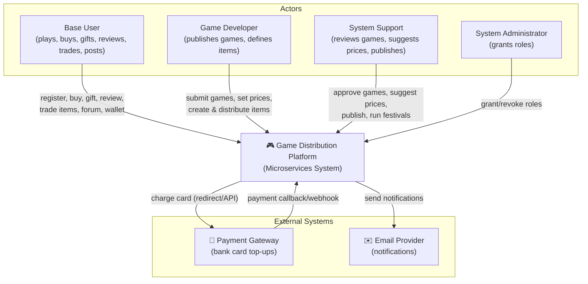
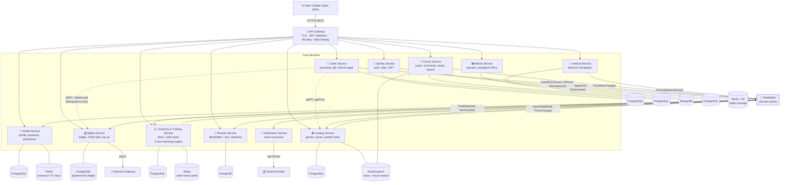
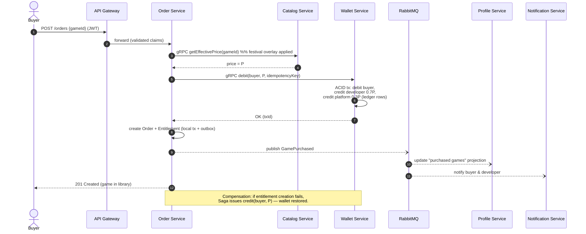
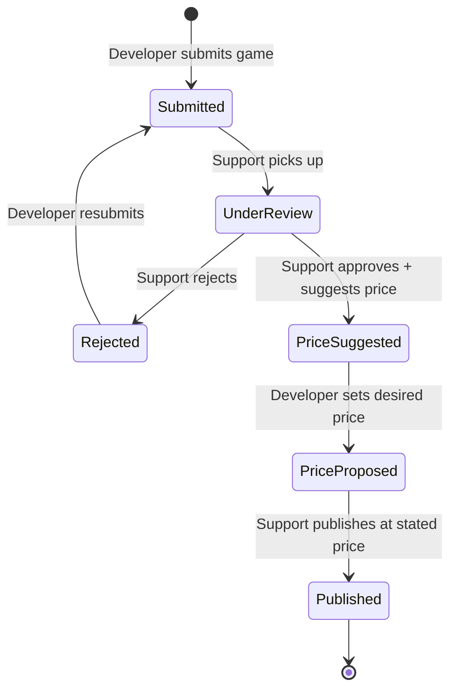
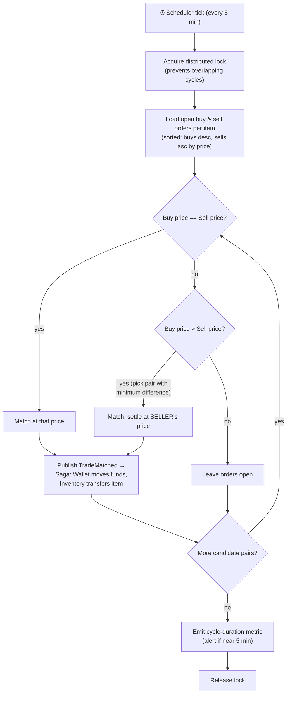

# فاز ۱: سند معماری و نیازمندی‌ها 
## پلتفرم انتشار بازی 

- **درس:** طراحی سیستم‌های میکروسرویس
- **شماره گروه:** گروه سوم 
- **متودولوژی انتخابی:** Disciplined Agile Delivery 
---

## فهرست مطالب
<ul dir="rtl" style="text-align: right; list-style-position: inside;">
    <li><a href="#۱-نیازمندیهای-عملکردی-داستانهای-کاربر">۱. نیازمندی‌های عملکردی (داستان‌های کاربر)</a>
        <ul>
            <li><a href="#۱۱-دامنه-مدیریت-هویت-و-حساب-کاربری">۱.۱ دامنه: مدیریت هویت و حساب کاربری</a></li>
            <li><a href="#۱۲-دامنه-انتشار-بازی-و-کاتالوگ">۱.۲ دامنه: انتشار بازی و کاتالوگ</a></li>
            <li><a href="#۱۳-دامنه-خرید-هدیه-دادن-و-استرداد-وجه">۱.۳ دامنه: خرید، هدیه دادن و استرداد وجه</a></li>
            <li><a href="#۱۴-دامنه-نقد-و-بررسیها-و-امتیازات">۱.۴ دامنه: نقد و بررسی‌ها و امتیازات</a></li>
            <li><a href="#۱۵-دامنه-تبادل-آیتمهای-درون-بازی-بازارچه">۱.۵ دامنه: تبادل آیتم‌های درون بازی (بازارچه)</a></li>
            <li><a href="#۱۶-دامنه-انجمن-فروم">۱.۶ دامنه: انجمن (فروم)</a></li>
            <li><a href="#۱۷-دامنه-کیف-پول-و-پرداختها">۱.۷ دامنه: کیف پول و پرداخت‌ها</a></li>
            <li><a href="#۱۸-دامنه-جشنوارهها-و-تخفیفها-پروموشنها">۱.۸ دامنه: جشنواره‌ها و تخفیف‌ها (پروموشن‌ها)</a></li>
        </ul>
    </li>
</ul>

<ul dir="rtl" style="text-align: right; list-style-position: inside;">
    <li><a href="#۲-نیازمندیهای-غیرعملکردی-و-ویژگیهای-کیفی">۲. نیازمندی‌های غیرعملکردی و ویژگی‌های کیفی</a></li>
</ul>

<ul dir="rtl" style="text-align: right; list-style-position: inside;">
    <li><a href="#۳-معماری-میکروسرویس-پیشنهادی">۳. معماری میکروسرویس پیشنهادی</a>
        <ul>
            <li><a href="#۳۱-استراتژی-تجزیه-decomposition-strategy">۳.۱ استراتژی تجزیه (Decomposition Strategy)</a></li>
            <li><a href="#۳۲-کاتالوگ-سرویسها">۳.۲ کاتالوگ سرویس‌ها</a></li>
            <li><a href="#۳۳-زیرساختهای-مشترک-cross-cutting-infrastructure">۳.۳ زیرساخت‌های مشترک (Cross-Cutting Infrastructure)</a></li>
        </ul>
    </li>
</ul>

<ul dir="rtl" style="text-align: right; list-style-position: inside;">
    <li><a href="#۴-نمودارهای-معماری">۴. نمودارهای معماری</a>
        <ul>
            <li><a href="#۴۱-نمودار-زمینه-سیستم-system-context-diagram">۴.۱ نمودار زمینه سیستم (System Context Diagram)</a></li>
            <li><a href="#۴۲-نمودار-کانتینر-container-diagram">۴.۲ نمودار کانتینر (Container Diagram)</a></li>
            <li><a href="#۴۳-نمودار-توالی-sequence-diagram">۴.۳ نمودار توالی (Sequence Diagram)</a></li>
            <li><a href="#۴۴-نمودار-وضعیت-state-diagram">۴.۴ نمودار وضعیت (State Diagram)</a></li>
            <li><a href="#۴۵-نمودار-فعالیت-activity-diagram">۴.۵ نمودار فعالیت (Activity Diagram)</a></li>
        </ul>
    </li>
</ul>

<ul dir="rtl" style="text-align: right; list-style-position: inside;">
    <li><a href="#۵-توجیه-معماری-و-قابلیت-ردیابی-traceability">۵. توجیه معماری و قابلیت ردیابی (Traceability)</a>
        <ul>
            <li><a href="#۵۱-پوشش-نیازمندیهای-عملکردی">۵.۱ پوشش نیازمندی‌های عملکردی</a></li>
            <li><a href="#۵۲-پوشش-نیازمندیهای-غیرعملکردی">۵.۲ پوشش نیازمندی‌های غیرعملکردی</a></li>
            <li><a href="#۵۳-تصمیمات-طراحی-و-trade-off">۵.۳ تصمیمات طراحی و Trade-off</a></li>
        </ul>
    </li>
</ul>

<ul dir="rtl" style="text-align: right; list-style-position: inside;">
    <li><a href="#۶-بخش-امتیازی-پیشنهادهای-مزیت-رقابتی">۶. بخش امتیازی: پیشنهادهای مزیت رقابتی</a>
        <ul>
            <li><a href="#۶۱-سرویس-پیشنهاد-بازی-مبتنی-بر-هوش-مصنوعی">۶.۱ سرویس پیشنهاد بازی مبتنی بر هوش مصنوعی</a></li>
            <li><a href="#۶۲-تحلیل-قیمت-آیتمها-و-تاریخچه-معاملات">۶.۲ تحلیل قیمت آیتم‌ها و تاریخچه معاملات</a></li>
            <li><a href="#۶۳-دستاوردها-و-اعتبار-گیمیفایشده">۶.۳ دستاوردها و اعتبار گیمیفای‌شده</a></li>
        </ul>
    </li>
</ul>
---

## ۱. نیازمندی‌های عملکردی (داستان‌های کاربر) 

### ۱.۱ دامنه: مدیریت هویت و حساب کاربری 

| داستان کاربر | شناسه |
|---:|:---:|
| به عنوان یک **مهمان**، می‌خواهم **به راحتی یک حساب کاربری ثبت کنم** (ایمیل/نام کاربری + رمز عبور، یا OAuth) تا **بتوانم به پلتفرم دسترسی داشته باشم**. | **US-01** |
| به عنوان یک **کاربر پایه**، می‌خواهم **احراز هویت شوم (ورود / خروج)** تا **بتوانم به صورت امن به حساب کاربری و خریدهایم دسترسی پیدا کنم**. | **US-02** |
| به عنوان یک **کاربر پایه**، می‌خواهم **درخواست ارتقا به نقش توسعه‌دهنده یا پشتیبان بدهم** تا **بتوانم بازی منتشر کنم یا پلتفرم را مدیریت کنم**. | **US-03** |
| به عنوان **مدیر سیستم** (حساب از پیش موجود)، می‌خواهم **هر نقشی را برای هر کاربری اعطا یا لغو کنم** تا **ارتقای نقش به صورت مرکزی کنترل شود**. | **US-04** |
| به عنوان یک **کاربر پایه**، می‌خواهم **پروفایلی با نام و عکس خود داشته باشم** تا **سایر کاربران بتوانند مرا بشناسند**. | **US-05** |
| به عنوان **هر کاربری**، می‌خواهم **لیست بازی‌هایی که یک کاربر خریداری کرده است را در پروفایل او ببینم** تا **با علایق گیمینگ او آشنا شوم**. | **US-06** |
| به عنوان **هر کاربری**، می‌خواهم **۵ پست برتر انجمن یک کاربر را (بر اساس بازخورد + تعداد نظرات در تمامی انجمن‌ها) در پروفایل او ببینم** تا **بتوانم ارزشمندترین مشارکت‌های او را کشف کنم**. | **US-07** |
| به عنوان **هر کاربری**، می‌خواهم **وضعیت آنلاین/آفلاین یک کاربر را در پروفایل او ببینم** تا **بدانم آیا او در حال حاضر در سیستم حضور دارد یا خیر**. | **US-08** |

### ۱.۲ دامنه: انتشار بازی و کاتالوگ 

| داستان کاربر | شناسه |
|---:|:---:|
| به عنوان یک **توسعه‌دهنده بازی**، می‌خواهم **یک بازی (فایل اجرایی، متادیتا، رسانه) را برای بررسی ارسال کنم** تا **در نهایت بتوان آن را در پلتفرم به فروش رساند**. | **US-09** |
| به عنوان **پشتیبان سیستم**، می‌خواهم **بازی ارسال شده را بررسی و آن را تایید یا رد کنم** تا **فقط محتوای باکیفیت به فروشگاه راه پیدا کند**. | **US-10** |
| به عنوان **پشتیبان سیستم**، می‌خواهم **پس از تایید، یک قیمت پیشنهادی به توسعه‌دهنده ارائه دهم** تا **قیمت‌گذاری توسط پلتفرم هدایت شود**. | **US-11** |
| به عنوان یک **توسعه‌دهنده بازی**، می‌خواهم **قیمت پیشنهادی را بررسی کرده و قیمت دلخواه خودم را ثبت کنم** تا **کنترل قیمت نهایی بازی‌ام را در دست داشته باشم**. | **US-12** |
| به عنوان **پشتیبان سیستم**، می‌خواهم **بازی را با قیمت اعلام شده توسط توسعه‌دهنده منتشر کنم** تا **بازی در فروشگاه قابل خرید شود**. | **US-13** |
| به عنوان **پلتفرم**، می‌خواهم **هر فروش به طور خودکار تقسیم شود: ۷۰٪ به کیف پول توسعه‌دهنده و ۳۰٪ به حساب پلتفرم** تا **تسهیم درآمد به صورت تراکنشی اعمال شود**. | **US-14** |

### ۱.۳ دامنه: خرید، هدیه دادن و استرداد وجه 

| داستان کاربر | شناسه |
|---:|:---:|
| به عنوان یک **کاربر پایه**، می‌خواهم **با استفاده از موجودی کیف پولم یک بازی منتشر شده را خریداری کنم** تا **به کتابخانه من اضافه شود**. | **US-15** |
| به عنوان یک **کاربر پایه**، می‌خواهم **یک بازی را به کاربر دیگری هدیه دهم** تا **او آن را در کتابخانه خود دریافت کند**. | **US-16** |
| به عنوان یک **کاربر پایه**، می‌خواهم **به صورت اختیاری با پرداخت ۰.۲٪ اضافه بهای قیمت بازی، یک پیام متنی به هدیه ضمیمه کنم** تا **بتوانم هدیه را شخصی‌سازی کنم**. | **US-17** |
| به عنوان یک **کاربر پایه**، می‌خواهم **در عرض ۱۲ ساعت پس از خرید، درخواست استرداد وجه (Refund) بدهم** تا **مبلغ پرداختی به کیف پولم برگردد**. | **US-18** |

### ۱.۴ دامنه: نقد و بررسی‌ها و امتیازات 

| داستان کاربر | شناسه |
|---:|:---:|
| به عنوان **کاربری که مالک بازی است**، می‌خواهم **یک نقد و بررسی شامل انتخاب اجباری لایک/دیس‌لایک به همراه یک متن توضیحی اجباری ثبت کنم** تا **نظر من به خریداران دیگر کمک کند**. | **US-19** |
| به عنوان **سیستم**، می‌خواهم **تلاش برای ثبت نقد از سوی کاربرانی که مالک بازی نیستند را رد کنم** تا **نقدها معتبر و واقعی باقی بمانند**. | **US-20** |
| به عنوان **هر کاربری**، می‌خواهم **نقد و بررسی‌های یک بازی را بخوانم** تا **بتوانم تصمیم آگاهانه‌ای برای خرید بگیرم**. | **US-21** |
| به عنوان **هر کاربری**، می‌خواهم **با استفاده از ایموجی به یک نقد واکنش نشان دهم** تا **بتوانم موافقت یا مخالفت خود را به سادگی بیان کنم**. | **US-22** |

### ۱.۵ دامنه: تبادل آیتم‌های درون بازی (بازارچه) 

| داستان کاربر | شناسه |
|---:|:---:|
| به عنوان یک **توسعه‌دهنده بازی**، می‌خواهم **تعداد دلخواهی آیتم درون‌برنامه‌ای برای بازی‌ام (بدون قیمت پیش‌فرض) تعریف کنم** تا **اقتصاد آیتم‌ها شکل بگیرد**. | **US-23** |
| به عنوان یک **توسعه‌دهنده بازی**، می‌خواهم **آیتم‌ها را بین مجموعه‌ای دلخواه یا تصادفی از بازیکنان با مقادیر دلخواه یا تصادفی توزیع کنم** تا **موجودی اولیه تامین شود**. | **US-24** |
| به عنوان یک **کاربر پایه**، می‌خواهم **یک سفارش خرید برای یک آیتم با قیمت دلخواهم ایجاد کنم** تا **بتوانم آیتم‌هایی که ندارم را به دست بیاورم**. | **US-25** |
| به عنوان یک **کاربر پایه که مالک یک آیتم است**، می‌خواهم **یک سفارش فروش با قیمت دلخواهم ایجاد کنم** تا **بتوانم از آیتم‌هایم درآمد کسب کنم**. | **US-26** |
| به عنوان **سیستم**، می‌خواهم **هر ۵ دقیقه یک چرخه تطابق (Matching Cycle) اجرا کنم** که: (الف) سفارش‌های خرید/فروش با **قیمت‌های کاملاً یکسان** را مطابقت دهد، و (ب) یک سفارش خرید با قیمت **بالاتر** از یک سفارش فروش را با استفاده از **حداقل اختلاف قیمت** مطابقت داده و با **قیمت (کمتر) فروشنده** تسویه کند، تا **معاملات به صورت عادلانه و قابل پیش‌بینی انجام شوند**. | **US-27** |
| به عنوان یک **خریدار/فروشنده تطابق یافته**، می‌خواهم **مالکیت آیتم و موجودی کیف پول پس از تطابق به صورت یکپارچه و تجزیه‌ناپذیر (Atomic) منتقل شوند** تا **هیچ وجه یا آیتمی از دست نرود**. | **US-28** |

### ۱.۶ دامنه: انجمن (فروم) 

| داستان کاربر | شناسه |
|---:|:---:|
| به عنوان **هر کاربری**، می‌خواهم **به صفحه اختصاصی انجمن هر بازی دسترسی داشته باشم** تا **بتوانم به جامعه آن بپیوندم**. | **US-29** |
| به عنوان **هر کاربری**، می‌خواهم **پست‌هایی شامل متن، عکس، ویدیو یا سایر رسانه‌ها ایجاد کنم** تا **بتوانم محتوای مرتبط با بازی را به اشتراک بگذارم**. | **US-30** |
| به عنوان **هر کاربری**، می‌خواهم **روی پست‌ها نظر (کامنت) بگذارم** تا **بحث و گفتگو توسعه یابد**. | **US-31** |
| به عنوان **هر کاربری**، می‌خواهم **با ایموجی (بازخورد) به پست‌ها واکنش نشان دهم** تا **محتوای محبوب و پرطرفدار برجسته شود**. | **US-32** |
| به عنوان **هر کاربری**، می‌خواهم **پست‌های درون انجمن یک بازی را جستجو و کاوش کنم** تا **بتوانم محتوای مرتبط را سریع پیدا کنم**. | **US-33** |

### ۱.۷ دامنه: کیف پول و پرداخت‌ها 

| داستان کاربر | شناسه |
|---:|:---:|
| به عنوان یک **کاربر پایه**، می‌خواهم **کیف پولم را از طریق یک درگاه پرداخت و با کارت بانکی شارژ کنم** تا **بتوانم بازی و آیتم بخرم**. | **US-34** |
| به عنوان یک **کاربر پایه**، می‌خواهم **کد یک گیفت‌کارت را برای افزایش موجودی کیف پولم استفاده (Redeem) کنم** تا **بتوانم بدون نیاز به کارت بانکی حسابم را شارژ کنم**. | **US-35** |
|به عنوان **پلتفرم**، می‌خواهم **استردادهای تایید شده، ثبت‌های اولیه دفتر کل (خریدار P+، توسعه‌دهنده 0.7P-، پلتفرم 0.3P-) را معکوس کنند** تا **حسابداری درآمدها صحیح و دقیق باقی بماند**. | **US-36** |

### ۱.۸ دامنه: جشنواره‌ها و تخفیف‌ها (پروموشن‌ها) 

| داستان کاربر | شناسه |
|---:|:---:|
| به عنوان **پلتفرم (مدیر/پشتیبان)**، می‌خواهم **جشنواره‌هایی ایجاد کنم که در هماهنگی با توسعه‌دهندگان، روی مجموعه‌ای از بازی‌ها تخفیف (حتی تا مرز رایگان شدن) اعمال کند** تا **فروش و تعامل کاربران افزایش یابد**. | **US-37** |
| به عنوان یک **توسعه‌دهنده بازی**، می‌خواهم **مشارکت و درصد تخفیف بازی‌ام در یک جشنواره را تایید کنم** تا **منافع مالی من حفظ و رعایت شود**. | **US-38** |
| به عنوان یک **کاربر پایه**، می‌خواهم **جشنواره‌های فعال را مرور کنم و بازی‌ها را با قیمت تخفیف‌خورده بخرم** تا **از این پیشنهادهای ویژه بهره‌مند شوم**. | **US-39** |

## ۲. نیازمندی‌های غیرعملکردی و ویژگی‌های کیفی

هر یک از نیازمندی‌های غیرعملکردی (NFR) زیر **مستقیماً بر اساس توضیحات پروژه توجیه شده است** — این مورد بر اساس روال نمره‌دهی الزامی است ("توجیه وجود هر یک از نیازمندی‌های غیرعملکردی مهم است").

### <bdi dir="ltr">NFR-01</bdi> : مقیاس‌پذیری (افقی)
* **نیازمندی:** هر سرویس Stateless باید به صورت افقی و مقیاس‌پذیر باشد؛ سرویس‌های با حجم خواندن بالا (کاتالوگ، انجمن) باید مستقل از سرویس‌های با حجم نوشتن بالا (کیف پول، معاملات) مقیاس‌پذیر باشند.
* **توجیه:** بار سیستم ذاتاً نابرابر است: جشنواره‌ها (بخش ۱.۸) باعث ایجاد جهش‌های ناگهانی ترافیک در بخش فروشگاه و جریان‌های پرداخت می‌شوند، در حالی که انجمن‌ها (بخش ۱.۶) ترافیک خواندن ثابتی تولید می‌کنند. یک معماری یکپارچه ما را مجبور می‌کند برای مدیریت پرفشارترین مسیر، کل سیستم را مقیاس‌دهی بکنیم؛ اما میکروسرویس‌ها به ما اجازه می‌دهند در طول یک جشنواره، فقط سرویس‌های کاتالوگ/سفارش را به صورت مجزا مقیاس‌دهی کنیم.

### <bdi dir="ltr">NFR-02</bdi> : دسترسی‌پذیری بالا و ایزوله‌سازی خطاها
* **نیازمندی:** هدف‌گذاری دسترسی‌پذیری روی $\ge$ ۹۹٫۹٪ برای جریان‌های اصلی خرید. یعنی مثلاً خرابی یک سرویس غیربحرانی (مانند انجمن) نباید باعث از کار افتادن فرآیند خرید شود.
* **توجیه:** درآمد پلتفرم به خریدها (بخش ۱.۲ و ۱.۳) و عملیات کیف پول (بخش ۱.۷) وابسته است. اگر پردازش رسانه‌ها در انجمن از کار بیفتد، کاربران همچنان باید بتوانند بازی بخرند. 

### <bdi dir="ltr">NFR-03</bdi> : یکپارچگی داده‌
* **نیازمندی:** واریز/برداشت کیف پول، تقسیم درآمد ۷۰/۳۰ (بخش ۱.۲)، اضافه قیمت هدایا (بخش ۱.۳)، استرداد وجه (بخش ۱.۷) و تسویه معاملات (بخش ۱.۵) نیاز به **یکپارچگی قوی (ACID)** دارند که از طریق تراکنش‌های ACID به علاوه **الگوی ساگا** در بین سرویس‌ها پیاده‌سازی می‌شود. ابزارک «۵ پست برتر» پروفایل (بخش ۱.۱)، تعداد نقدها و وضعیت آنلاین ممکن است دارای **Eventual Consistency** باشند.
* **توجیه:** از دست دادن یا دو بار کسر کردن پول (مثلاً دو بار کسر هزینه یک هدیه، دو بار پرداخت به توسعه‌دهنده) قابل قبول نیست و چالش‌های حقوقی به دنبال دارد. در مقابل، اگر ابزارک ۵ پست برتر یک کاربر چند ثانیه تاخیر داشته باشد، تاثیر تجاری منفی خاصی ندارد. کاهش سطح یکپارچگی در این موارد خاص، موجب بهبود عملکرد و در دسترس بودن سیستم می‌شود.

### <bdi dir="ltr">NFR-04</bdi> : امنیت و کنترل دسترسی‌ها
* **نیازمندی:** احراز هویت متمرکز (JWT/OAuth2)، کنترل دسترسی مبتنی بر نقش برای چهار نقش سیستم، رمزنگاری انتقال داده (TLS)، هش کردن رمزهای عبور، و مدیریت پرداخت‌ها با رعایت استانداردهای PCI (یعنی مثلاً شماره کارت‌ها هرگز نباید ذخیره شوند).
* **توجیه:** داک پروژه چهار نقش متمایز با دسترسی‌های سلسله‌مراتبی (بخش ۱.۱) و یک مدیر که نقش‌ها را اعطا می‌کند تعریف کرده است. این دقیقاً نیازمند پیاده‌سازی RBAC است. سیستم با پول واقعی (بخش ۱.۷) و داده‌های شخصی (پروفایل‌ها، تاریخچه خرید) سروکار دارد، بنابراین احراز هویت، مجوز دادن و ایزوله‌سازی ایمن ضروری و بدیهی هستند.

### <bdi dir="ltr">NFR-05</bdi> : عملکرد و تأخیر
* **نیازمندی:** صدک ۹۵ (p95) تأخیر $\lt$ ۳۰۰ میلی‌ثانیه برای مرور/جستجوی فروشگاه؛ چرخه تطابق تبادل آیتم‌ها باید حتی با Order Books بزرگ، با حاشیه امن در بازه ۵ دقیقه‌ای خود تکمیل شود. هم‌چنین جستجوی وضعیت آنلاین کاربران باید NearRealTime باشد.
* **توجیه:** بخش ۱.۵ الزام می‌کند یک تطابق‌گر **هر ۵ دقیقه** اجرا شود. اگر چرخه‌ای بیش از ۵ دقیقه طول بکشد، چرخه‌ها هم‌پوشانی پیدا می‌کنند و سفارشات دو بار پردازش می‌شوند. بخش ۱.۱ نیازمند وضعیت آنلاین *زنده* است که به معنای وجود یک مکانیسم حضور با تأخیر پایین است (Heartbeats + فضای ذخیره‌سازی درون‌حافظه‌ای). جستجوی انجمن (بخش ۱.۶) برای این‌که خوش‌دست باشد باید آنی به نظر برسد.

### <bdi dir="ltr">NFR-06</bdi> : قابلیت اطمینان جریان‌های کاری
* **نیازمندی:** رویدادها (خرید تکمیل شد -> درآمد تقسیم شود؛ یا مثلاً معامله تطابق یافت -> آیتم و وجه منتقل شود؛ یا باز هم مثلاً استرداد تایید شد -> به کیف پول واریز شود) باید به‌طور کاملاً قابل اطمینان تحویل داده شوند. با استفاده از مصرف‌کنندگان idempotent و **الگوی Transactional Outbox**.
* **توجیه:** جریان کاری انتشار (بخش ۱.۲) و استرداد وجه (بخش ۱.۷) فرآیندهایی چندمرحله‌ای و توزیع‌شده در چند سرویس هستند. بدون پیام‌رسانی قابل اطمینان، یک خرابی در سیستم بین مرحله‌ی «سفارش ثبت شد» و «حساب توسعه‌دهنده شارژ شد»، به‌طور خاموش سهم ۷۰ درصدی توسعه‌دهنده را از بین می‌برد.

### <bdi dir="ltr">NFR-07</bdi> : قابلیت ردیابی
* **نیازمندی:** هر تغییر مالی (تراکنش کیف پول، معامله، استرداد، تسهیم درآمد) باید در یک دیتابیس فقط‌افزودنی و تغییرناپذیر ثبت شود؛ ردیابی توزیع‌شده (Correlation IDs) باید در تمامی سرویس‌ها اعمال شود.
* **توجیه:** اختلافات مربوط به استرداد وجه (بخش ۱.۷، قانون بازپرداخت ۱۲ ساعته) و تقسیم ۷۰/۳۰ (بخش ۱.۲) نیازمند این است که پلتفرم بتواند *ثابت کند* چه اتفاقی در سیستم افتاده است. در یک سیستم توزیع‌شده، یک اقدام کاربر با ۳ تا ۵ سرویس درگیر است. لذا بدون قابلیت ردیابی، کشف باگ یک پرداخت گم‌شده عملاً غیرممکن است.

### <bdi dir="ltr">NFR-08</bdi> : تغییرپذیری و توسعه‌پذیری
* **نیازمندی:** افزودن یک دامنه جدید (به‌عنوان مثال جشنواره‌های مناسبتی یا مثلاً در آینده انواع جدیدی از پروموشن‌ها اضافه خواهند شد) نباید نیازمند ایجاد تغییر در سرویس‌های نامرتبط باشد. معماری تمیز در درون هر سرویس، منطق دامنه را از فریم‌ورک‌ها و دیتابیس‌ها کاملاً مستقل می‌کند.
* **توجیه:** یکی از جاهایی که این ویژگی ممکن است به درد ما بخورد، تصمیم به افزودن یک فیچر جدید (مثل فیچرهای امتیازی) است. معماری باید بتواند یک سرویس کاملاً جدید (مانند سیستم توصیه‌گر) را با هیچ تغییری در سرویس‌های فعلی در خود جای دهد. که این موضوع با ایجاد Loose Coupling به کمک رویدادمحور بودن محقق می‌شود.

### <bdi dir="ltr">NFR-09</bdi> : استقرارپذیری و Portability
* **نیازمندی:** هر سرویس باید به عنوان یک ایمیج داکر (Docker Image) مستقل ارائه شود؛ کل سیستم باید فقط با یک دستور `docker compose up` بالا بیاید؛ طراحی باید به منظور دریافت نمره امتیازی به شکل تمیزی قابل نگاشت به کوبرنیتیز (Deployments, Services, HPA) باشد.
* **توجیه:** در بخش قوانین نمره‌دهی صراحتاً الزامی شده است (بخش ۲.۲: "داکرایز کردن پروژه الزامی است... استفاده صحیح از Docker Compose... نمره امتیازی برای کوبرنیتیز").

### <bdi dir="ltr">NFR-10</bdi> : مشاهده‌پذیری
* **نیازمندی:** لاگ‌برداری ساختاریافته‌ی متمرکز، جمع‌آوری متریک‌ها، Health Checks به ازای هر سرویس، و هشداردهی در مورد مدت زمان چرخه تطابق معاملات بازارچه.
* **توجیه:** با وجود حدود ۱۰ سرویس، یک Message Broker و چندین دیتابیس مختلف، پرسش «آیا سیستم سالم است؟» را نمی‌توان صرفاً با زدن SSH به یک سرور پاسخ داد. SLA پنج دقیقه‌ای معاملات (بخش ۱.۵) به طور خاص نیاز به مانیتورینگ دقیق متریک‌ها دارند تا اگر زمان پردازش طولانی شد، پیش از خراب شدن دفتر سفارشات، هشدار لازم صادر شود.

## ۳. معماری میکروسرویس پیشنهادی

### ۳.۱ استراتژی تجزیه (Decomposition Strategy)

سرویس‌ها بر اساس **Bounded Contexts** در **طراحی دامنه محور (DDD)** تجزیه شده‌اند (یک قابلیت تجاری به ازای هر سرویس، الگوی پایگاه‌داده به ازای هر سرویس). در سطح داخلی، هر سرویس از **معماری تمیز** پیروی می‌کند: 

`Domain → Application → Interface Adapters → Infrastructure `

 این ساختار باعث می‌شود قوانین تجاری (مانند "تسهیم ۷۰/۳۰"، "پنجره زمانی ۱۲ ساعته استرداد وجه"، "تطابق با قیمت فروشنده") مستقل از فریم‌ورک باقی بمانند و کاملاً Unit-Testable باشند.

### ۳.۲ کاتالوگ سرویس‌ها

| ارتباطات | پایگاه داده (دلیل انتخاب) | مسئولیت | سرویس | ردیف |
|---:|---:|---:|---:|---:|
| **همگام (REST)** برای ورود/ثبت‌نام؛ انتشار رویدادهای `UserRegistered` و `RoleGranted`. | **PostgreSQL**. داده‌های رابطه‌ای کاربر/نقش/اعتبارنامه؛ نیاز به یکپارچگی ACID برای اعطای نقش‌ها. | ثبت‌نام، ورود (صدور JWT از طریق OAuth2/OIDC)، مدیریت نقش‌ها، درخواست‌های ارتقای نقش، اعطای نقش توسط مدیر. | **سرویس هویت** (Identity Service) | ۱ |
| **همگام (REST)** برای خواندن اطلاعات؛ **مصرف‌کننده** رویدادهای `GamePurchased` و `PostStatsChanged` برای به‌روزرسانی پروجکشن‌ها (مدل خواندن در CQRS). | **PostgreSQL** (داده‌های پروفایل) + **Redis** (حضور: کلیدهای heartbeat با TTL؛ وضعیت آنلاین = وجود کلید در کش). | نام، عکس، لیست بازی‌های خریداری شده (Projection)، ابزارک ۵ پست برتر (Projection)، وضعیت آنلاین. | **سرویس پروفایل** (Profile Service) | ۲ |
| **همگام (REST/gRPC)** (مرور فروشگاه، استعلام قیمت توسط سرویس سفارش)؛ انتشار `GamePublished` و `PriceChanged`. | **PostgreSQL**. کاتالوگ ساختاریافته با فیلترهای رابطه‌ای؛ + **Elasticsearch** (نسخه دوم) برای جستجو در فروشگاه. | متادیتای بازی، لینک رسانه‌ها، قیمت‌گذاری، ماشین وضعیت انتشار (`ارسال‌شده → در‌حال‌بررسی → قیمت‌پیشنهادی → قیمت‌تعیین‌شده → منتشر‌شده`)، اعمال تخفیف‌های جشنواره. | **سرویس کاتالوگ** (Catalog Service) | ۳ |
| **ناهمگام** از طریق واسط پیام‌رسان با کاتالوگ و اعلان‌ها؛ **همگام (REST)** برای رابط کاربری بررسی. | **PostgreSQL**. تاریخچه تغییرات وضعیت (Audit trail) جریان کاری. | هماهنگ‌سازی مذاکره بین توسعه‌دهنده ↔ پشتیبان: ارسال، نتیجه بررسی، قیمت پیشنهادی، قیمت متقابل توسعه‌دهنده، انتشار نهایی. | **سرویس جریان کاری انتشار** (Publishing Workflow) *(احتمالاً در فاز ۲ درون کاتالوگ ادغام شود)* | ۴ |
| **همگام (gRPC)** به کیف پول (کسر وجه) و کاتالوگ (قیمت)؛ انتشار `GamePurchased`، `GiftSent` و `RefundIssued`. | **PostgreSQL**. سفارشات و مجوزهای دسترسی، رکوردهای تراکنشی محسوب می‌شوند. | خریدها، هدیه دادن (شامل اضافه بهای ۲۰۰٪ برای پیام = ۳ برابر کل)، درخواست‌های استرداد وجه (قانون ۱۲ ساعته)، دسترسی‌های کتابخانه (Entitlements). مدیریت **ساگای خرید (Purchase Saga)**. | **سرویس سفارش** (Order Service) | ۵ |
| **همگام (gRPC)** (دستورات واریز/برداشت با کلیدهای تکرارپذیری)؛ **ناهمگام** مصرف رویدادهای `TradeSettled` و `RefundIssued`؛ **همگام (REST)** به درگاه پرداخت خارجی. | **PostgreSQL**. قوی‌ترین نیاز به ACID در کل سیستم؛ جدول دفتر کل با رکوردهای حسابداری دوطرفه. | موجودی‌ها، شارژ از طریق درگاه پرداخت، استفاده از گیفت‌کارت، بازگشت وجه استرداد، ثبت رکوردهای دفتر کل تسهیم درآمد ۷۰/۳۰. دفتر کل تراکنش‌های فقط‌افزودنی (Append-only). | **سرویس کیف پول** (Wallet Service) | ۶ |
| **همگام (REST)**؛ بررسی مالکیت از طریق رویدادهای کش‌شده `GamePurchased` (پروجکشن محلی) به جای فراخوانی همزمان — جلوگیری از وابستگی (Coupling) در زمان اجرا به سرویس سفارش. | **MongoDB**. نقدها + واکنش‌های تودرتو ساختار سندی دارند؛ نیازی به تراکنش‌های بین-موجودیتی نیست. | نقد و بررسی‌های لایک/دیس‌لایک + متن اجباری؛ بررسی مالکیت بازی؛ واکنش‌های ایموجی روی نقدها. | **سرویس نقد و بررسی** (Review Service) | ۷ |
| **اول-ناهمگام (Async-first)**: انتشار `TradeMatched`؛ کیف پول مصرف کرده و وجه را تسویه می‌کند؛ موجودی با دریافت رویداد `PaymentSettled` آیتم را منتقل می‌کند. زمان‌بند (Scheduler) تطابق را آغاز می‌کند. | **PostgreSQL** (دارایی‌ها + سفارشات؛ قفل‌گذاری در سطح ردیف در طول چرخه تطابق) + **Redis** (کش برای دفتر سفارشات). | تعریف آیتم‌ها توسط توسعه‌دهنده، اعطای آیتم (توزیع دلخواه/تصادفی)، دارایی آیتم‌های کاربران، دفتر سفارشات خرید/فروش، **موتور تطابق دسته‌ای ۵ دقیقه‌ای**، ساگای تسویه معامله. | **سرویس موجودی و معاملات** (Inventory & Trading) | ۸ |
| **همگام (REST)** برای عملیات CRUD؛ انتشار `PostStatsChanged` (تغذیه ابزارک ۵ پست برتر پروفایل)؛ باینری‌های رسانه‌ها از طریق سرویس رسانه به **ذخیره‌ساز شیء (Object Storage)** می‌روند. | **MongoDB**. مناسب رسانه، ساختار تودرتو؛ + **Elasticsearch** برای جستجوی تمام‌متن پست‌ها. | انجمن‌های اختصاصی هر بازی، پست‌های دارای رسانه، نظرات، بازخورد ایموجی، آمار پست‌ها. | **سرویس انجمن** (Forum Service) | ۹ |
| **همگام (REST)** (URLهای آپلود امضاشده)؛ عملیات‌های ناهمگام تولید تصویر بندانگشتی از طریق بروکر پیام. | **MinIO**. باینری بلابز نباید در دیتابیس ذخیره شوند. | آپلود، هوک ویروس‌کشی، تولید تصویر بندانگشتی، ارائه URLهای امضاشده از پیش (Pre-signed URLs) برای عکس/ویدیو/فایل باینری. | **سرویس رسانه** (Media Service) | ۱۰ |
| انتشار `FestivalStarted/Ended` → کاتالوگ با دریافت آن، تخفیف‌ها را اعمال می‌کند؛ **همگام (REST)** برای رابط کاربری مدیریت. | **PostgreSQL**. برنامه‌های زمانی و تاییدیه‌ها رابطه‌ای بوده و حجم پایینی دارند. | چرخه حیات جشنواره، تایید مشارکت توسعه‌دهندگان، برنامه‌های زمانی تخفیف (حتی تا ۱۰۰٪). | **سرویس جشنواره** (Festival Service) | ۱۱ |
| **مصرف‌کننده خالص (Pure consumer)** رویدادهای دامنه؛ هیچ سرویسی آن را به صورت همگام فراخوانی نمی‌کند. | **MongoDB** یا بدون دیتابیس (بدون حالت + اتصال به بروکر) — لاگ اعلان‌ها یک دیتابیس سندی ساده است. | ایمیل‌ها / اعلان‌های درون‌برنامه‌ای: هدیه دریافت شد (با پیام پولی)، نتایج بررسی‌ها، معامله انجام شد، استرداد وجه پردازش شد. | **سرویس اعلان‌ها** (Notification Service) | ۱۲ |

### ۳.۳ زیرساخت‌های مشترک (Cross-Cutting Infrastructure)

| نقش | انتخاب | جزء |
|---:|---:|---:|
| نقطه ورود واحد؛ خاتمه TLS (TLS termination)؛ اعتبارسنجی JWT؛ مسیریابی؛ محدودسازی نرخ درخواست؛ لاگ‌برداری از درخواست‌ها. | Spring Cloud Gateway / Kong / Traefik | **API Gateway** |
| مدیریت تمام رویدادهای دامنه؛ ساگاها را ایزوله می‌کند؛ استفاده از الگوی صندوق خروجی تراکنشی و مصرف‌کنندگان تکرارپذیر (NFR-06) را ممکن می‌سازد. RabbitMQ برای محدوده این درس انتخاب شده؛ اما در صورت نیاز به بازپخش رویدادها، کافکا جایگزین می‌شود. | **RabbitMQ** (یا Kafka) | **واسط پیام‌رسان** (Broker) |
| Gateway امضا را تایید می‌کند؛ سرویس‌ها نقش‌ها را از درون Claimهای توکن می‌خوانند → پیاده‌سازی RBAC بدون حالت (Stateless) در همه‌جا. | OAuth2/OIDC، توکن‌های دسترسی JWT امضاشده توسط سرویس هویت | **احراز هویت** (Auth) |
| جلوگیری از اجرای ابزارهای اضافی مثل Eureka/Consul؛ خود پلتفرم امکان کشف را به صورت بومی فراهم می‌کند. | Docker Compose DNS (فاز ۲) → Kubernetes Services/DNS (نمره امتیازی) | **کشف سرویس** (Service Discovery) |
| الزامات NFR-07/NFR-10 را برآورده می‌کند؛ هشداردهی پیش از نقض SLA مدت زمان چرخه تطابق. | Prometheus + Grafana، لاگ‌های ساختاریافته JSON (Loki/ELK)، ردیابی OpenTelemetry | **مشاهده‌پذیری** (Observability) |
| انطباق با اپلیکیشن‌های ۱۲ عاملی (12-factor)، قابلیت حمل (NFR-09). | متغیرهای محیطی از طریق Compose / ConfigMaps & Secrets در K8s | **پیکربندی و اسرار** (Config & Secrets) |

* **الگوی Database per Service**: هیچ اسکیمای پایگاه داده‌ای بین سرویس‌ها مشترک نیست؛ یکپارچه‌سازی فقط از طریق APIها یا رویدادها انجام می‌شود.

* **الگوی Saga - Orchestration** برای خرید، هدیه دادن، استرداد وجه و تسویه معاملات؛ جایگزین کردن تراکنش‌های Distributed ACID با اقدامات جبرانی (مثلاً بازگرداندن وجه به کیف پول اگر اعطای بازی با شکست مواجه شود).

* **الگوی Transactional Outbox**: رویدادها دقیقاً در همان تراکنش محلی‌ای ذخیره می‌شوند که تغییرات وضعیت رخ داده است، و سپس به واسط Broker ارسال می‌گردند.

* **الگوی Projection CQRS**: سرویس پروفایل به جای استعلام گرفتن (Query) همزمان از ۳ سرویس به ازای هر بار نمایش پروفایل، «بازی‌های خریداری شده» و «۵ پست برتر» را از طریق گوش دادن به رویدادها Materialize می‌کند.

* **الگوی Idempotency Keys** روی تمامی اندپوینت‌هایی که با پول سر و کار دارند؛ برای امکان‌پذیر کردن تلاش‌های دوباره و امن.

* **الگوی Circuit Breakers + timeouts** روی هر فراخوانی همگام؛ به منظور ایزوله‌سازی خرابی‌ها و جلوگیری از سرایت آن‌ها (NFR-02).

## ۴. نمودارهای معماری

### ۴.۱ نمودار زمینه سیستم (System Context Diagram)

### ۴.۲ نمودار کانتینر (Container Diagram)

### ۴.۳ نمودار توالی (Sequence Diagram)

### ۴.۴ نمودار وضعیت (State Diagram)

### ۴.۵ نمودار فعالیت (Activity Diagram)

## ۵. توجیه معماری و قابلیت ردیابی (Traceability)

این بخش نشان می‌دهد معماری طراحی‌شده در بخش ۳، چطور نیازمندی‌های پروژه را به صورت عملی حل می‌کند.

### ۵.۱ پوشش نیازمندی‌های عملکردی

| نحوه پوشش آن توسط معماری | نیازمندی (داستان‌های کاربر) |
|---:|---:|
| سرویس هویت (Identity) ثبت‌نام و لاگین را انجام می‌دهد. توکن JWT شامل نقش کاربر است، پس بقیه سرویس‌ها بدون نیاز به استعلام از دیتابیس می‌فهمند کاربر چه دسترسی‌هایی دارد (RBAC). تغییر نقش هم با صدور توکن جدید اعمال می‌شود. | **حساب‌ها و نقش‌ها (US-01…US-04)** |
| برای جلوگیری از کندی، به جای اینکه هر بار از ۳ سرویس مختلف کوئری بگیریم (الگوی CQRS)، سرویس پروفایل رویدادهای خرید و پست‌ها را گوش می‌دهد و در دیتابیس خودش ذخیره می‌کند. وضعیت آنلاین هم با کلیدهای زمان‌دار (TTL) در Redis هندل می‌شود. | **پروفایل غنی کاربر (US-05…US-08)** |
| مراحل بررسی بازی به شکل یک «ماشین وضعیت» (State Machine) پیاده شده تا دقیقاً طبق سناریو، فقط پشتیبان بتواند تایید کند و فقط توسعه‌دهنده حق تعیین قیمت داشته باشد. | **مذاکره انتشار بازی (US-09…US-13)** |
| سهم ۷۰ درصدی توسعه‌دهنده و ۳۰ درصدی پلتفرم دقیقاً در **یک تراکنش دیتابیس (ACID)** در سرویس کیف پول ثبت می‌شود تا امکان بروز خطای مالی یا واریز ناقص صفر باشد. | **تسهیم درآمد ۷۰/۳۰ (US-14)** |
| قیمت نهایی هدیه به علاوه هزینه پیام، در سرویس سفارش محاسبه و یکجا کسر می‌شود. سپس با یک رویداد (`GiftSent`)، هدیه و پیام به گیرنده اختصاص می‌یابد. | **هدیه دادن + اضافه بهای ۲۰۰٪ (US-16, US-17)** |
| اگر از زمان خرید کمتر از ۱۲ ساعت گذشته باشد، الگوی ساگا (Saga) وارد عمل می‌شود: بازی از کاربر گرفته شده و پول دقیقاً با ثبت رکوردهای معکوس در کیف پول به او برمی‌گردد. | **استرداد وجه ۱۲ ساعته (US-18, US-36)** |
| سرویس نقدها، رویدادهای خرید را کش می‌کند تا بدون نیاز به درخواستِ همزمان از سرویس سفارش، بفهمد کاربر بازی را خریده است یا نه. از دیتابیس MongoDB هم استفاده کردم چون برای ذخیره لایک‌ها و کامنت‌های تو در تو عالی است. | **نقدهای مختص مالکان بازی (US-19…US-22)** |
| یک زمان‌بند هر ۵ دقیقه سفارش‌های خرید و فروش را بررسی می‌کند. اگر مچ شدند، پول و آیتم از طریق ساگا جابه‌جا می‌شوند. در صورت بروز هرگونه خطا، تراکنش‌ها لغو و جبران می‌شوند تا پول یا آیتمی گم نشود. | **اقتصاد آیتم‌ها و تطابق (US-23…US-28)** |
| پست‌ها در MongoDB ذخیره می‌شوند و فایل‌های سنگین برای جلوگیری از فشار به سرور اصلی مستقیماً به MinIO می‌روند. برای قابلیت جستجوی سریع در متن پست‌ها هم از Elasticsearch استفاده کردم. | **انجمن با رسانه و جستجو (US-29…US-33)** |
| اتصال به درگاه بانکی پشت یک لایه واسط قرار دارد. اطلاعات کارت بانکی سمت ما نمی‌آید (امنیت). کدهای گیفت‌کارت هم طوری طراحی شده‌اند که فقط یک‌بار قابل مصرف باشند. | **شارژ کیف پول و گیفت‌کارت‌ها (US-34, US-35)** |
| جشنواره‌ها روی قیمت‌های کاتالوگ یک «تخفیف موقت» اعمال می‌کنند. چون سرویس سفارش همیشه قیمت نهایی را از کاتالوگ می‌خواند، نیازی به تغییر در کدهای سمت سفارش یا درگاه پرداخت نیست. | **جشنواره‌ها (US-37…US-39)** |

### ۵.۲ پوشش نیازمندی‌های غیرعملکردی

| مکانیزم معماری که آن را برآورده می‌کند | نیازمندی غیرعملکردی (NFR) |
|---:|---:|
| سرویس‌ها Stateless هستند و به راحتی با اضافه کردن کانتینر مقیاس می‌گیرند. مثلاً موقع جشنواره‌ها می‌توانیم فقط به سرویس فروشگاه منابع بیشتری بدهیم. | **NFR-01 مقیاس‌پذیری** |
| جدا بودن دیتابیس‌ها و استفاده از رویدادهای ناهمگام (Event-driven). مثلاً اگر سرویس انجمن قطع شود، سیستم خرید بازی همچنان بدون مشکل کار می‌کند. | **NFR-02 دسترسی‌پذیری و ایزوله‌سازی خطا** |
| در بخش مالی از ACID و تراکنش‌های دقیق استفاده کردم. اما برای مواردی مثل آپدیت شدن تعداد لایک‌ها، تاخیر چند ثانیه‌ای (Eventual Consistency) را به نفع پرفورمنس پذیرفتم. | **NFR-03 یکپارچگی (در موارد حساس)** |
| احراز هویت متمرکز با JWT، بررسی نقش‌ها در همه سرویس‌ها، استفاده از TLS و عدم ذخیره اطلاعات حساس کارت‌های بانکی در دیتابیس‌های خودمان. | **NFR-04 امنیت** |
| استفاده از Redis برای چک کردن سریع وضعیت آنلاین، و Elasticsearch برای جستجو در چند میلی‌ثانیه. الگوی CQRS هم جلوی کوئری‌های سنگین بین‌سرویسی را می‌گیرد. | **NFR-05 عملکرد و تاخیر** |
| استفاده از الگوی Transactional Outbox و RabbitMQ تا مطمئن شوم هیچ رویدادی در شبکه گم نمی‌شود و در صورت قطعی، پیام‌ها دوباره ارسال می‌شوند. | **NFR-06 جریان‌های کاری ناهمگام قابل اطمینان** |
| کیف پول طوری طراحی شده که فقط به آن رکورد اضافه می‌شود (Append-only) تا تاریخچه پول‌های جابجا شده دقیقاً قابل حسابرسی باشد. | **NFR-07 حسابرسی** |
| استفاده از معماری تمیز (Clean Architecture). اگر فردا سرویس جدیدی اضافه کنیم، فقط کافیست به رویدادهای RabbitMQ گوش دهد و نیازی به دستکاری کدهای قدیمی نیست. | **NFR-08 تغییرپذیری / توسعه‌پذیری** |
| کل پروژه با یک فایل `docker-compose.yml` بالا می‌آید و به صورت داکرایزشده کاملاً آماده استقرار روی کوبرنیتیز است. | **NFR-09 استقرارپذیری** |
| تعریف اندپوینت سلامت برای سرویس‌ها، مانیتورینگ متریک‌ها با Prometheus و یک هشدار اختصاصی که اگر تطابق سفارشات بیشتر از ۵ دقیقه طول کشید، خبر بدهد. | **NFR-10 مشاهده‌پذیری** |
### ۵.۳ تصمیمات طراحی و Trade-off
* **استفاده از ساگا به جای قفل کردن دیتابیس‌ها:** برای جلوگیری از کند شدن سیستم، اجازه می‌دهیم تغییرات در چند مرحله انجام شوند. اگر وسط کار خطایی رخ داد، با عملیات جبرانی (مثل پس دادن پول به کیف پول) آن را هندل می‌کنیم. 
* **پذیرش Eventual Consistency:** قبول کردیم که اگر کاربری بازی را خرید، شاید یکی دو ثانیه طول بکشد تا در لیست پروفایلش نمایش داده شود. این تاخیر کم در ازای بالا رفتن سرعت کل سیستم ارزشش را دارد.
* **پیچیدگی میکروسرویس:** مدیریت چند دیتابیس و کانتینر سخت‌تر از یک برنامه یکپارچه است، اما برای رعایت الزامات مقیاس‌پذیری و ایزوله بودن خطاها (NFR-01 و NFR-02) ضروری بود.
* **ادغام احتمالی سرویس‌ها در فاز پیاده‌سازی:** با توجه به زمان محدود پروژه، ممکن است در فاز ۲ «جریان کاری انتشار» را داخل همان «سرویس کاتالوگ» بنویسیم تا پیاده‌سازی ساده‌تر شود (معماری فعلی اجازه این کار را بهمان می‌دهد).

## ۶. بخش امتیازی: پیشنهادهای مزیت رقابتی

هر کدام از این ایده‌های زیر می‌توانند در فاز ۲ به عنوان **یک سرویس داکرایز شده مجزا** اضافه بشوند.

### ۶.۱ 🎯 سرویس پیشنهاد بازی مبتنی بر هوش مصنوعی 
* **چیستی:** یک سرویس توصیه‌گر که با توجه به رویدادهای خرید، لایک/دیس‌لایک نقدها و فعالیت‌های انجمن، لیست «پیشنهاد شده برای شما» را می‌سازد. برای سادگی می‌توانیم از الگوریتم‌های ساده استفاده کنیم که حتی به GPU هم نیاز ندارند.
* **مزیت:** پیدا کردن بازی‌های جدید باعث فروش بازی‌های ناشناخته می‌شود. با این کار هم بازی‌ساز بیشتر دیده می‌شود و هم پلتفرم ۳۰ درصد سود بیشتری از فروش‌هایی می‌برد که در حالت عادی اتفاق نمی‌افتاد.
* **نحوه‌ی پیاده‌سازی:** یک کانتینر Python/FastAPI بالا می‌آوریم. یک Cronjob مدل را آموزش می‌دهد و نتایج را برای خواندن سریع فرانت‌اند داخل Redis می‌ریزد.
### ۶.۲ 📊 تحلیل قیمت آیتم‌ها و تاریخچه معاملات
* **چیستی:** سرویسی به نام `MarketAnalyticsService` که رویدادهای `TradeMatched` را می‌خواند و تاریخچه قیمت‌ها را به شکل نمودار کندل و حجم معاملات به کاربر نشان می‌دهد تا «قیمت منصفانه» را راحت‌تر پیدا کند.
* **مزیت:** شفافیت باعث اعتماد کاربر و افزایش حجم معاملات در بازارچه می‌شود. 
* **نحوه‌ی پیاده‌سازی:** یک سرویس بک‌اند ساده، یک دیتابیس TimescaleDB (افزونه Postgres مخصوص داده‌های زمانی) و یک کتابخانه رسم نمودار در فرانت‌اند.
### ۶.۳ 🏆 دستاوردها و اعتبار گیمیفای‌شده 
* **چیستی:** سرویس `AchievementService` که با توجه به کارهای کاربر (مثل اولین خرید، گرفتن ۱۰ لایک روی نقدها یا فعالیت زیاد در انجمن) به او بج و XP می‌دهد. این سطح در صفحه پروفایل کاربر نمایش داده می‌شود.
* **مزیت:** گیمیفیکیشن کاربر را در پلتفرم نگه می‌دارد. وقتی لایک گرفتن امتیاز داشته باشد، کاربر وقت می‌گذارد و نقد بهتری می‌نویسد. این ایده بدون اضافه کردن یک بخش سنگین و نامربوط، پروفایل کاربری را خیلی جذاب‌تر می‌کند.
* **نحوه‌ی پیاده‌سازی:** فقط یک سرویس و یک دیتابیس Postgres که صرفاً به رویدادها گوش می‌دهد. به نظر می‌رسد پیاده‌سازی این مورد نسبت به گزینه‌های دیگر آسان‌تر باشد.

